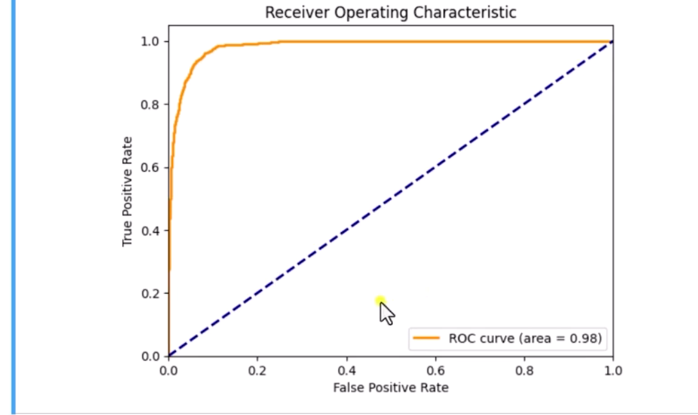
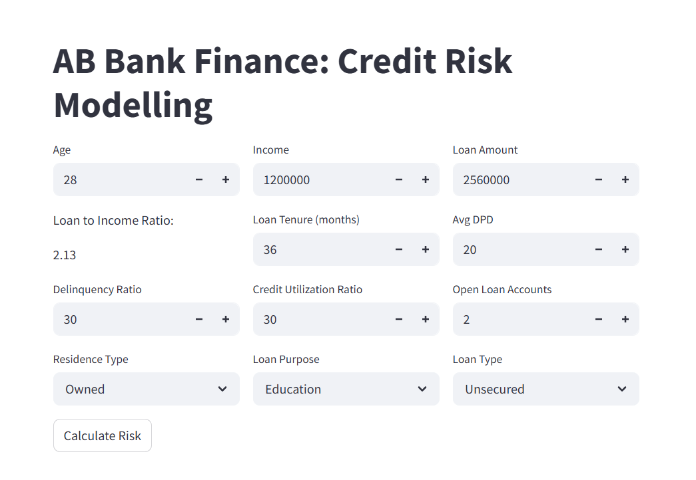
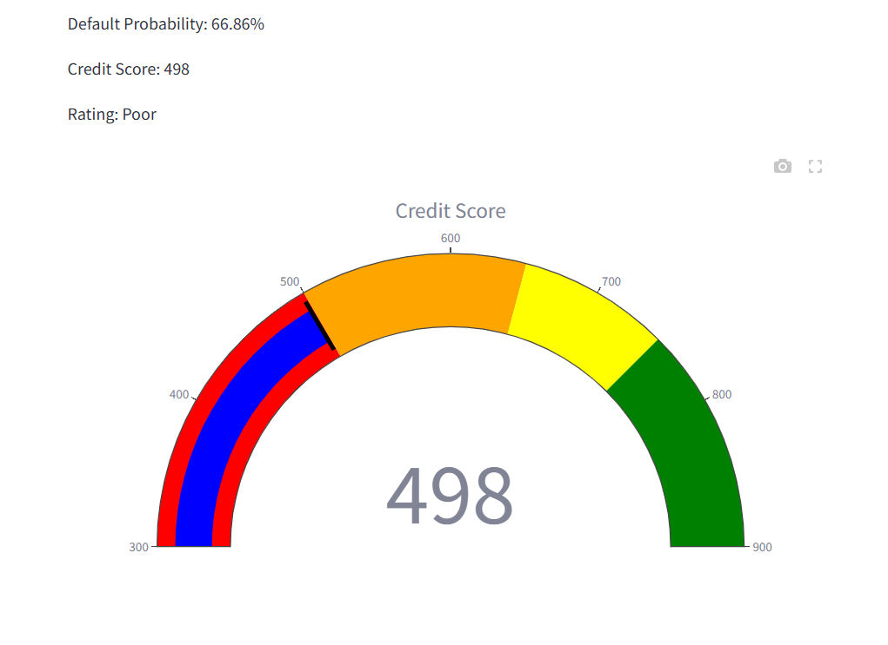

# 📊 AB Bank Finance: Credit Risk Modelling

## 📝 Project Overview  
This project focuses on **credit risk assessment** for loan applicants. After experimenting with multiple algorithms, the final model chosen was **Logistic Regression**, as it offered the best balance between interpretability and performance.  

The solution predicts **default probability, credit score, and risk rating**, visualized with an interactive Plotly gauge. It is deployed as a **Streamlit web app** for accessibility by non-technical stakeholders, supporting **data-driven decision-making** in financial services.  

---

## 🚀 Features
- Interactive **Streamlit web application** for loan risk evaluation  
- Predicts:  
  - Default probability (%)  
  - Credit score (numerical)  
  - Risk rating (categorical: High / Medium / Low)  
- **Plotly Gauge visualization** for intuitive interpretation of credit score  
- Modular design for easy extension and improvements  

---

## 📂 Project Structure
Credit_risk_model/
│── app.py # Main Streamlit app
│── prediction_helper.py 
│── artifacts/model_data.joblib # Saved trained model
│── requirements.txt 
│── README.md   # Documentation (this file)


## 🧑‍💻 Tech Stack
- **Language**: Python 3.8+  
- **Libraries**:  
  - Streamlit – Web app interface  
  - Plotly – Credit score visualization  
  - scikit-learn – Machine learning model training  
  - XGBoost, RandomForest – alternative models tested  
  - pandas, NumPy – Data preprocessing & feature engineering  
  - joblib – Model serialization  

---

## 📊 Dataset
- **Source**: Dataset provided as part of a **data science bootcamp project** (educational purpose)  
- **Size**: ~50,000 rows × 15 columns  
- **Features include**:  
  - Income, loan amount, employment status, residence type  
  - Years at current address, loan ID, loan purpose  
  - Number of open and closed accounts, delinquent months, and total DPD  
  - Loan tenure (months), credit history, age  

**Preprocessing**:  
- Missing values handled via **mode imputation**  
- Feature engineering:  
  - IV values  
  - Income-to-loan ratio  
  - Delinquent month to loan month ratio  
  - Average DPD per delinquent month  
- Encoding categorical variables with **one-hot encoding**  

---

## 🤖 Model Development
- **Algorithms Tried**: Logistic Regression, Random Forest, XGBoost  
- **Final Choice**: Logistic Regression (best trade-off between interpretability and performance)  
- **Training Process**:  
  - Train-test split: 80:20  
  - Class imbalance handled with:
    - **Random undersampling** – tested but less effective    
    - **SMOTETomek (over-sampling)** – final approach  
    
  - Cross-validation: **3-fold CV**  
  - Hyperparameter tuning:
    - **GridSearchCV & RandomSearchCV** – tested during experiments 
    - **Optuna** – final choice for efficiency  

---

## 📈 Model Performance
- **Final Logistic Regression Model**:  
  - Accuracy: 93%  
  - AUC-ROC: 0.98  
  - Gini Coefficient: 0.96  
  - Precision: 56% | Recall: 94% | F1-score: 70%  
  - Recall improved significantly (from 72% baseline → 94%)  

📌 ROC curve:
  


---

## 🎨 Demo & Visualization
-**Streamlit App**: Provides sliders and inputs for real-time predictions
- **Plotly Gauge Meter**: Displays credit score dynamically for easy interpretation  
  






---

## 🌐 Deployment
- **Platform**: Streamlit Cloud  
- **Link**:https://credit-risk-model-0.streamlit.app/
- **Steps Taken**:  
  - Trained model saved using joblib  
  - Integrated with Streamlit app  
  - Deployed via Streamlit Cloud  

---

## 📖 How to Run Locally
```bash
# Clone the repository
git clone https://github.com/imran6999/Credit_risk_model.git
cd Credit_risk_model

# Create a virtual environment
python -m venv venv
source venv/bin/activate  # Linux/Mac
venv\Scripts\activate     # Windows

# Install dependencies
pip install -r requirements.txt

# Run the app
streamlit run app.py

📌 Future Improvements
Add model interpretability (SHAP/LIME)
Compare multiple ML models in-app for transparency
Improve dataset robustness with data augmentation or synthetic sampling
Enhance deployment with Docker + CI/CD

👤 Author

Imran Chowdhury
Data Scientist | AI Enthusiast
